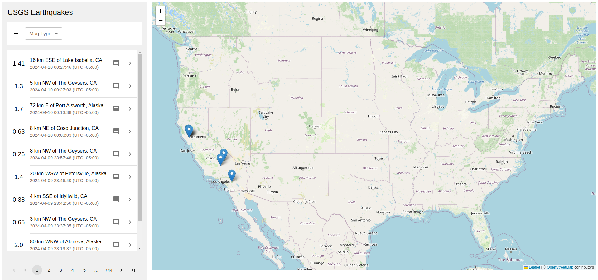
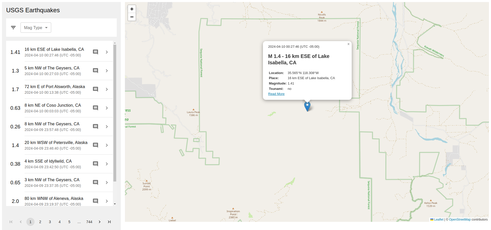

# Earthquake App

 

## Overview

This project is a web application that displays and visualizes earthquakes that have occurred in the last 30 days. The application is divided into two main parts: a Ruby on Rails backend API server for the backend logic and a React frontend client integrated using the `react_on_rails` gem for the user interface.

## Project Structure

```
earthquake/
│
├── app/ # Rails application source code
│ └── javascript/ # Frontend React client
│   └── ... # React client components and files
├── config/ # Rails application configuration
├── db/ # Migrations and database schema
│ └── development.sqlite # Development database
├── lib/ # Additional libraries
│ └── tasks # Custom Rake tasks
│   └── data_import.rake # Rake task for data import
├── spec/ # RSpec tests
├── Gemfile # Ruby dependencies
├── Gemfile.lock # Exact versions of dependencies
│
└── README.md # General project documentation
```

## Technologies Used

- **Backend**: Ruby on Rails was chosen for its robustness and ease of creating RESTful APIs. SQLite was used as the database due to its ease of configuration and portability.

- **Frontend**: React was chosen for its ability to create interactive and reactive user interfaces, integrated in Rails with the `react_on_rails` gem.

- **Database**: SQLite was chosen for its simplicity and ease of use, ideal for a medium-sized project like this.

## Design Decisions

- **Integration with react_on_rails**: React was integrated into the Rails project using the `react_on_rails` gem, making it easy to create React components within the Rails ecosystem.

- **Separation of Backend and Frontend**: Despite the integration, the responsibilities between the backend and the frontend are kept separate, allowing each part to be scaled and modified independently.

- **Backend Data Validation**: All data validations are performed on the backend to ensure the integrity of the data stored in the database.

- **Importing External Data**: A custom task was added to import data from an external source. This allows updating the database with the latest earthquakes.

## Running Tests

To run tests for the backend API, follow these steps:

1. Run `bundle install` to install the necessary dependencies.
2. Run `rails db:migrate RAILS_ENV=test` to make the changes in the database.
3. Run `rspec` to execute the RSpec tests.

## Execution Instructions

1. Clone the repository from GitHub.
2. Install dependencies for both the backend and frontend.
3. Run migrations to create the database.
4. Run the custom task to import earthquake data: `bundle exec rake data_import:import_features`.
5. Start the backend server and frontend client: `./bin/dev`.
6. Access the application from the home page served by Rails.

This project has been developed so that it can be easily deployed in a production environment once completed and successfully tested.

The API and client could be separated into different projects in distinct environments. You can modify the base URL of the API by editing the `.env` file.
